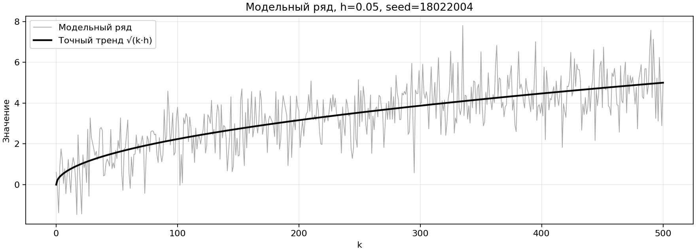
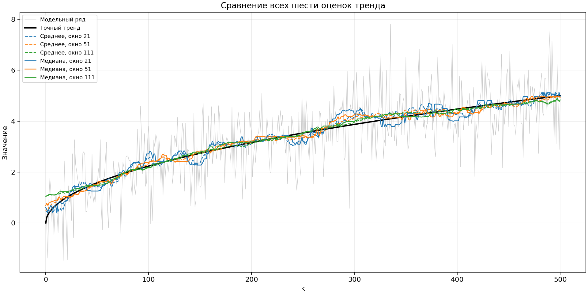
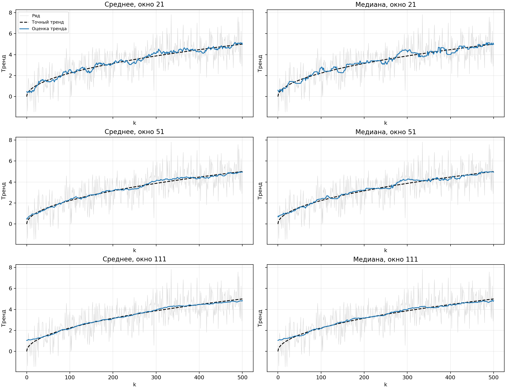
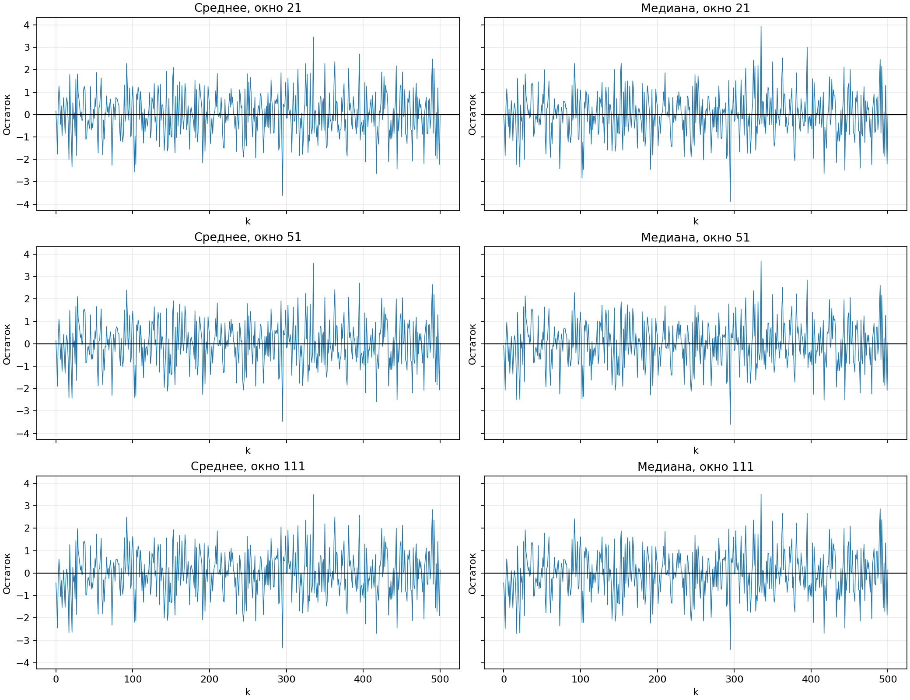

# Лабораторная работа 02_01 — результаты

## Запуск

Из корня проекта: `python3 -m pip install -r labs/02_01/requirements.txt`, затем `python3 labs/02_01/main.py`. Файлы результатов сохраняются рядом с программой в `results/`. Повторный запуск обновляет их.

## Модель и обработка краёв

xₖ = √(k·0.05) + εₖ, k = 0,…,500; εₖ — независимые N(0,1). 501 отсчёт, генератор NumPy RandomState, seed=18022004, как в принятом примере.

Для окна w=2m+1 среднее равно сумме x[k−m:k+m+1], делённой на w; медиана — центральному элементу отсортированного окна. На краях окно сокращается: start=max(0,k−m), end=min(501,k+m+1); используются элементы x[start:end]. Среднее делится на фактическое число элементов. Так же обработаны края в принятом примере. Все шесть оценок содержат 501 значение.

## Сравнение с точным трендом

Все ошибки рассчитаны на полном ряде k=0,…,500, включая края, как в примере. MSE = mean((оценка − точный тренд)²); RMSE = √MSE; MAE = mean(|оценка − точный тренд|).

| Метод | Окно | MSE | MAE | RMSE |
|---|---:|---:|---:|---:|
| Среднее | 21 | 0.039150 | 0.164085 | 0.197863 |
| Среднее | 51 | 0.016281 | 0.105252 | 0.127596 |
| Среднее | 111 | 0.019199 | 0.087196 | 0.138559 |
| Медиана | 21 | 0.057601 | 0.189658 | 0.240003 |
| Медиана | 51 | 0.024429 | 0.120934 | 0.156297 |
| Медиана | 111 | 0.022129 | 0.100130 | 0.148757 |

## Проверка остатков

Для каждого из шести трендов вычислены остатки rₖ=xₖ−оценка тренда. Оба критерия применяются ко всем 501 остаткам каждого варианта. Двусторонние проверки: α=0.05, критическое |z|≈1.9600. При p<α гипотеза отвергается. Поправка на множественные проверки не применяется.

### Поворотные точки

T — число строгих локальных экстремумов. По слайду 6: E(T)=2(n−2)/3, D(T)=(16n−29)/90; z=(T−E(T))/√D(T). p норм. — двусторонняя вероятность стандартного нормального распределения.

Если значения совпадают, предпосылка непрерывного распределения нарушена. В таком случае решение принимается по двустороннему перестановочному p: 4999 случайных перестановок остатков с сохранением совпадений, seed=2026; p=min(1, 2·min((1+#(T*≤T))/5000, (1+#(T*≥T))/5000)). Это проверка случайного порядка условно на наблюдаемых значениях. z и p норм. приведены для сопоставления с лекцией.

| Метод | Окно | n | T | E(T) | z | p норм. | p для решения | Способ |
|---|---:|---:|---:|---:|---:|---:|---:|---|
| Среднее | 21 | 501 | 325 | 332.667 | -0.8138 | 0.4157 | 0.4157 | normal |
| Среднее | 51 | 501 | 327 | 332.667 | -0.6015 | 0.5475 | 0.5475 | normal |
| Среднее | 111 | 501 | 327 | 332.667 | -0.6015 | 0.5475 | 0.5475 | normal |
| Медиана | 21 | 501 | 326 | 332.667 | -0.7077 | 0.4791 | 0.5976 | permutation |
| Медиана | 51 | 501 | 327 | 332.667 | -0.6015 | 0.5475 | 0.5780 | permutation |
| Медиана | 111 | 501 | 327 | 332.667 | -0.6015 | 0.5475 | 0.5664 | permutation |

### Коэффициент Кендела

Сравниваются все пары i<j. P — число rⱼ>rᵢ, Q — число rⱼ<rᵢ, S=P−Q. Без совпадений формула слайда 7: τ=4P/[n(n−1)]−1, D(τ)=2(2n+5)/[9n(n−1)]. В расчёте используется scipy.stats.kendalltau, как в принятом примере. При совпадениях он возвращает tau-b: τ=S/√(N·(N−B)), где N=n(n−1)/2, B — число равных пар. Без совпадений tau-a и tau-b совпадают.

При совпадениях используется поправка: D(S)=[n(n−1)(2n+5)−Σ t(t−1)(2t+5)]/18, где t — число одинаковых значений в каждой группе; z=S/√D(S). Индексы времени уникальны. Нулевые остатки медианного сглаживания не заменяются искусственным шумом. Нормальная проверка приближённая. Формула поправки сверена с [реализацией SciPy](https://github.com/scipy/scipy/blob/v1.17.1/scipy/stats/_stats_py.py).

| Метод | Окно | P | Q | Равные пары | τ (tau-b) | z | p |
|---|---:|---:|---:|---:|---:|---:|---:|
| Среднее | 21 | 62121 | 63129 | 0 | -0.008048 | -0.2693 | 0.7877 |
| Среднее | 51 | 62745 | 62505 | 0 | 0.001916 | 0.0641 | 0.9489 |
| Среднее | 111 | 64162 | 61088 | 0 | 0.024543 | 0.8211 | 0.4116 |
| Медиана | 21 | 62578 | 62347 | 325 | 0.001847 | 0.0617 | 0.9508 |
| Медиана | 51 | 63457 | 61778 | 15 | 0.013406 | 0.4485 | 0.6538 |
| Медиана | 111 | 64896 | 60351 | 3 | 0.036288 | 1.2141 | 0.2247 |

## Выводы

На этой реализации минимальная RMSE у метода «Среднее», окно 51: 0.127596. Это результат конкретного случайного ряда, а не универсальный выбор окна.

- Среднее: RMSE при окнах 21 → 51 → 111: 0.197863 → 0.127596 → 0.138559.
- Медиана: RMSE при окнах 21 → 51 → 111: 0.240003 → 0.156297 → 0.148757.

Большое окно сильнее подавляет шум, но может сглаживать изгибы тренда. Медиана устойчива к выбросам; здесь шум нормальный и дополнительные выбросы не вводились, поэтому преимущества медианы заранее не предполагаются.

- Среднее, окно 21: критерий поворотных точек не отвергает случайный порядок; критерий Кендела не обнаруживает значимого монотонного тренда.
- Среднее, окно 51: критерий поворотных точек не отвергает случайный порядок; критерий Кендела не обнаруживает значимого монотонного тренда.
- Среднее, окно 111: критерий поворотных точек не отвергает случайный порядок; критерий Кендела не обнаруживает значимого монотонного тренда.
- Медиана, окно 21: критерий поворотных точек не отвергает случайный порядок; критерий Кендела не обнаруживает значимого монотонного тренда.
- Медиана, окно 51: критерий поворотных точек не отвергает случайный порядок; критерий Кендела не обнаруживает значимого монотонного тренда.
- Медиана, окно 111: критерий поворотных точек не отвергает случайный порядок; критерий Кендела не обнаруживает значимого монотонного тренда.

Неотвержение гипотезы не доказывает случайность или независимость. Два критерия выявляют разные нарушения: локальные колебания и монотонный тренд. Соседние оценки используют общие наблюдения, поэтому после вычитания тренда остатки могут быть зависимыми даже при независимом исходном шуме. Здесь критерии применяются как диагностика остатков по заданию.

Исходные данные, оценки и остатки: [series.csv](series.csv). Численные результаты: [metrics.csv](metrics.csv). Основа решения — «Лекция 9», слайды 6, 7, 9, 13, 14.

## Сверка с принятым примером

[Код примера](https://github.com/azya0/big_data_2025/blob/main/labs/02_lost/main.py), [зависимости](https://github.com/azya0/big_data_2025/blob/main/labs/02_lost/requirements.txt), [условие](https://github.com/azya0/big_data_2025/blob/main/labs/02_lost/2_lost.png).

| Пункт | Реализация |
|---|---|
| 1. Модельный ряд | Те же 501 отсчёт, h=0.05, нормальный шум и seed=18022004. |
| 2. Скользящее среднее | Окна 21, 51, 111; на краях — доступная часть окна. |
| 3. Скользящая медиана | Те же окна и обработка краёв. На графиках показана именно медиана. |
| 4. Сравнение с точным трендом | Графики, MSE на всех 501 точках, численные выводы. |
| 5. Проверка остатков | Строгие поворотные точки, E(T), коэффициент scipy.stats.kendalltau для всех шести вариантов. |

Дополнительно к числам из примера приведены p-value и решения при α=0.05. Для совпадающих остатков медианы проверка поворотных точек уточнена перестановками; формулы лекции также приведены. Графики сохраняются в PNG. В requirements.txt перечислены используемые библиотеки: NumPy, Matplotlib и SciPy; остальные пакеты из окружения примера для этой работы не требуются.
