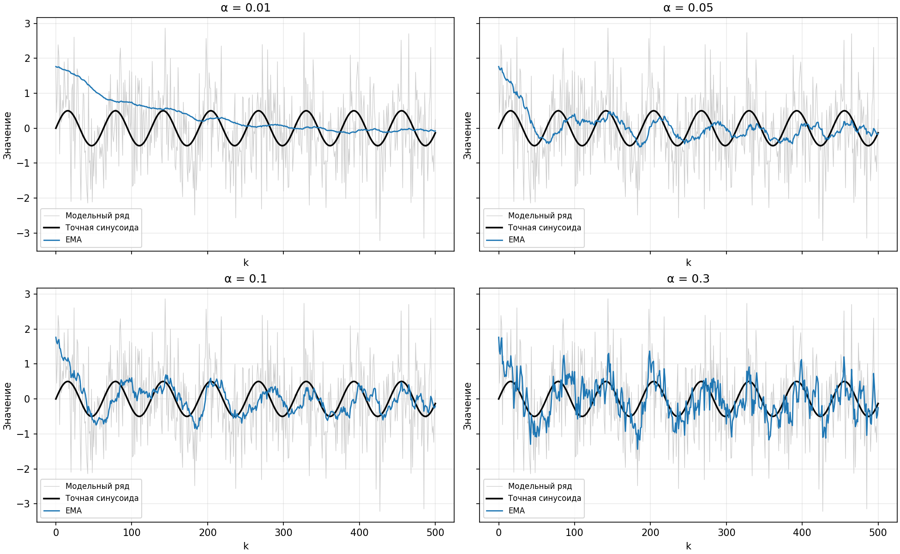
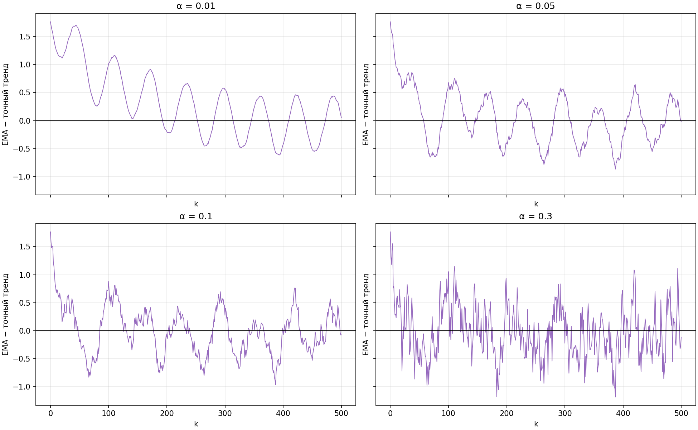
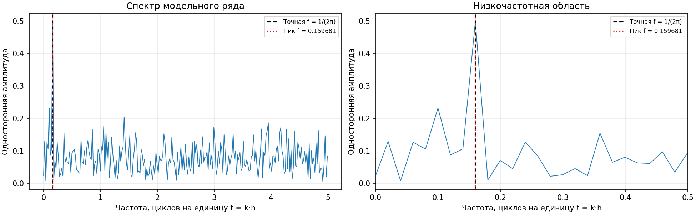
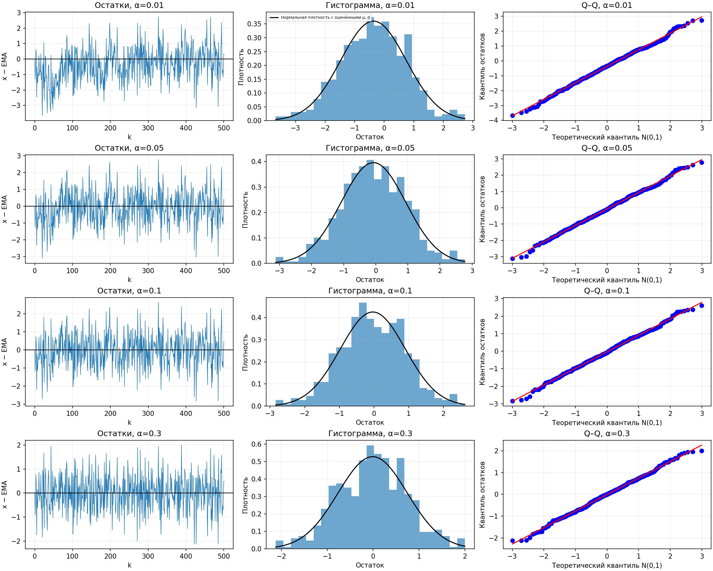

# Лабораторная работа 02_02 — результаты

## Запуск

Запуск из корня проекта: `.venv/bin/python labs/02_02/main.py`.

Графики и отчёт сохраняются в `labs/02_02/results`. Повторный запуск обновляет результаты.

## Модельный ряд и выделение тренда

xₖ=0.5·sin(k·h)+εₖ, k=0,…,500, h=0.1; εₖ — независимые N(0,1). Сгенерирован 501 отсчёт, seed=0. Точный тренд — 0.5·sin(k·h).

Экспоненциальное скользящее среднее: y₀=x₀, yₖ=αxₖ+(1−α)yₖ₋₁. Использованы коэффициенты α=0.01, 0.05, 0.1, 0.3. Все расчёты включают начальный участок.

На рисунке серым показан модельный ряд, чёрным — точный тренд, синим — EMA. При малом α оценка меняется медленно; при большом — сильнее реагирует на шум.

## Сравнение с точным трендом

Ошибка оценки eₖ=yₖ−0.5·sin(k·h). MSE = mean(e²), по всем 501 точкам. Корреляции Пирсона и Кендела в таблице характеризуют связь оценки с точным трендом.

| α | MSE | Корреляция Пирсона | Корреляция Кендела |
|---:|---:|---:|---:|
| 0.01 | 0.450109 | 0.100439 | 0.038595 |
| 0.05 | 0.220025 | 0.238865 | 0.123944 |
| 0.1 | 0.185558 | 0.424880 | 0.288096 |
| 0.3 | 0.219752 | 0.561588 | 0.389924 |

Горизонтальная линия соответствует нулевой ошибке. Отклонения от неё показывают, насколько оценка отличается от точной синусоиды.

Лучшая оценка для этой реализации шума: **α=0.1**, MSE=0.185558. Малое α сильнее сглаживает, но запаздывает и дольше сохраняет влияние начального значения. Большое α пропускает больше шума.

## Амплитудный спектр Фурье и главная частота

**f=0.15968064** циклов/ед. времени; ω=1.00330304 рад/ед. времени; T=6.262500. Теоретически f₀=1/(2π)≈0.15915494, ω₀=1. Шаг сетки FFT: 0.01996008.

FFT рассчитано для исходного ряда. Пик ищется среди положительных частот. На графике — односторонняя амплитуда 2·|FFT|/n (кроме нулевой частоты); в примере |FFT|/n. Для этого ряда положение пика одинаковое. Небольшое отличие от теоретической частоты объясняется сеткой FFT и шумом.

Слева показан весь спектр, справа — низкочастотная область. Чёрная пунктирная линия обозначает теоретическую частоту, красная — найденный максимум.

## Проверка остатков x−EMA

Для каждого коэффициента сглаживания вычислены остатки rₖ=xₖ−yₖ. Проверки выполнены по всем 501 значениям; r₀=0 из-за начального условия EMA.

Уровень значимости 0.05. При p<0.05 гипотеза отвергается. t-тест проверяет нулевое среднее, Шапиро — Уилк — нормальность, Льюнг — Бокс — отсутствие автокорреляции до лага 10, критерий серий — порядок значений относительно медианы, Кендел — отсутствие монотонного тренда. Поворотные точки — строгие локальные экстремумы остатков.

| α | Среднее | s | p t-теста | p Шапиро | p Льюнга — Бокса | p серий |
|---:|---:|---:|---:|---:|---:|---:|
| 0.01 | -0.363966 | 1.107718 | 7.90005e-13 | 0.511265 | 3.65015e-41 | 0.0441795 |
| 0.05 | -0.072615 | 1.007515 | 0.107326 | 0.732769 | 1.77026e-06 | 0.0667286 |
| 0.1 | -0.035372 | 0.939551 | 0.39982 | 0.613625 | 0.189839 | 0.561044 |
| 0.3 | -0.009364 | 0.754823 | 0.781386 | 0.503728 | 0.000388636 | 0.0284193 |

| α | Поворотные точки | E(T) | p поворотов | τ остатков/времени | p Кендела |
|---:|---:|---:|---:|---:|---:|
| 0.01 | 347 | 332.667 | 0.12813 | 0.202922 | 1.12681e-11 |
| 0.05 | 345 | 332.667 | 0.190463 | 0.065868 | 0.0275386 |
| 0.1 | 347 | 332.667 | 0.12813 | 0.036327 | 0.224203 |
| 0.3 | 353 | 332.667 | 0.0308944 | 0.015968 | 0.593166 |

В каждой строке слева показаны остатки, в центре — их гистограмма и нормальная плотность с оценёнными средним и стандартным отклонением, справа — Q–Q график. Близость его точек к прямой согласуется с нормальностью; численная проверка выполнена тестом Шапиро — Уилка.

## Выводы по остаткам

- α=0.01: нарушения случайности выявлены критериями Льюнга — Бокса, серий, Кендела; нулевое среднее отвергается; нормальность не отвергается.
- α=0.05: нарушения случайности выявлены критериями Льюнга — Бокса, Кендела; нулевое среднее не отвергается; нормальность не отвергается.
- α=0.1: применённые критерии не выявили нарушений случайности; нулевое среднее не отвергается; нормальность не отвергается.
- α=0.3: нарушения случайности выявлены критериями Льюнга — Бокса, серий, поворотных точек; нулевое среднее не отвергается; нормальность не отвергается.

Неотвержение гипотез не доказывает независимость или нормальность. При обнаруженной автокорреляции проверки среднего и нормальности рассматриваются как приближённая диагностика. Поправка на множественные проверки не применяется.
