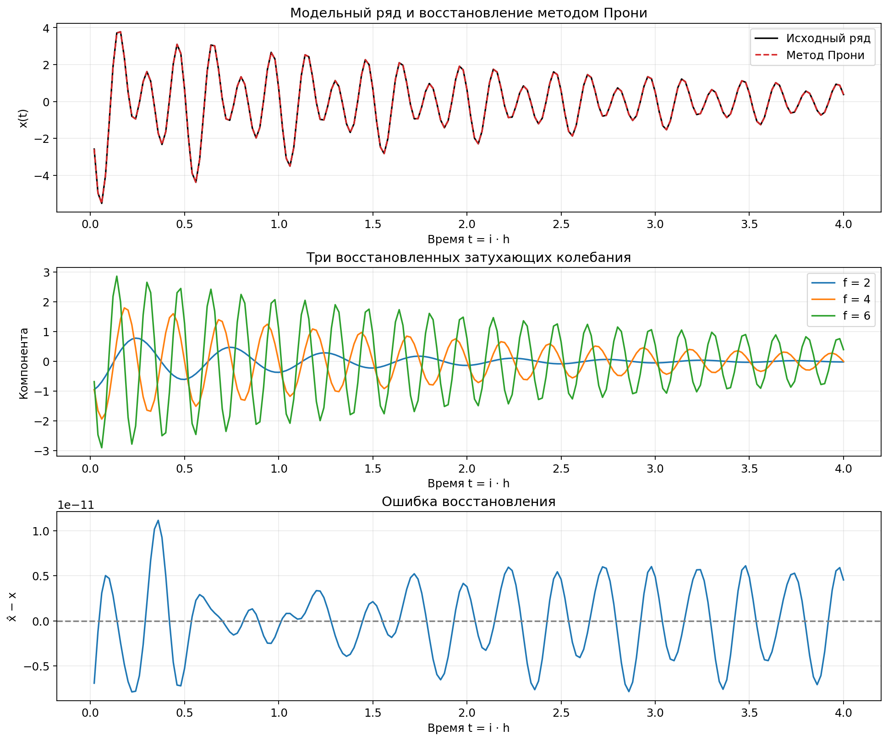
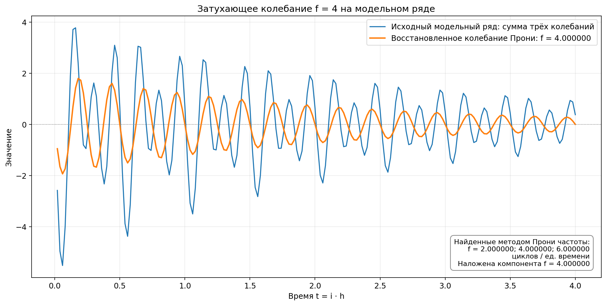
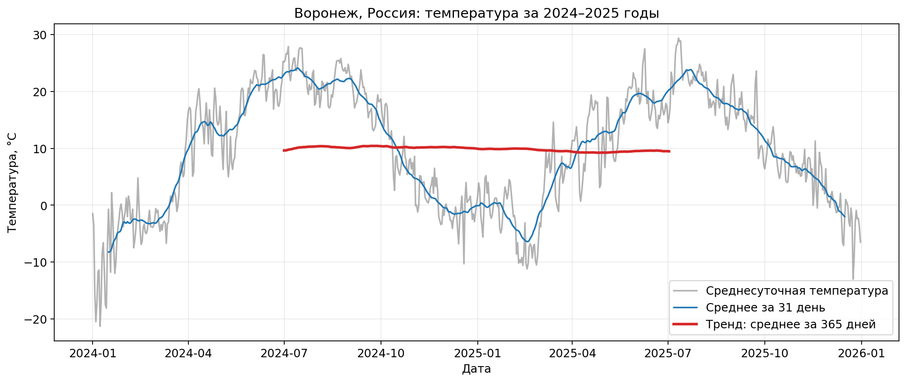
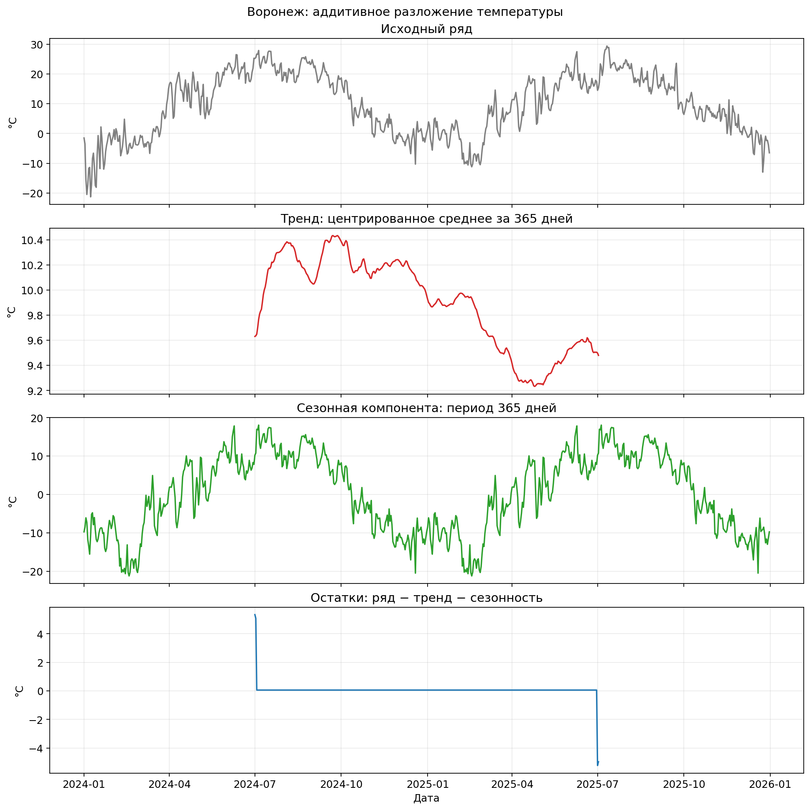
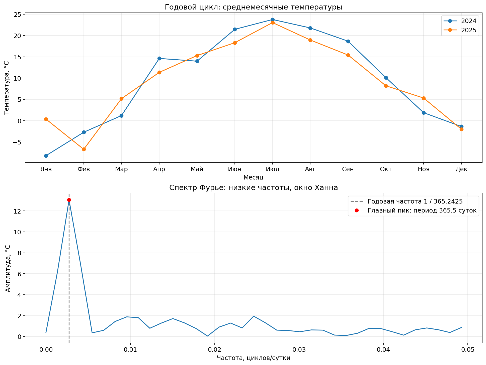

# Лабораторная работа 03_01

## Условие

1. Составить на языке Python программу разложения ряда по методу Прони. Для её проверки сгенерировать модельный ряд

   $$x_i = \sum_{k=1}^{3} k\exp\left(-\frac{hi}{k}\right)\cos\left(4\pi khi+\frac{\pi}{k}\right), \qquad i=1,\ldots,200,\quad h=0.02,$$

   и применить к нему метод Прони.

2. Найти в интернете данные по среднесуточным температурам за два года своего населённого пункта и провести их анализ на наличие тренда и сезонных колебаний.

## Запуск

Структура соответствует примеру: `task1.py` — метод Прони, `task2.py` — анализ температур, `weather_parser.py` — загрузка данных.

Команды из корня проекта (в текущем окружении вместо `python` можно использовать `.venv/bin/python`):

- `python labs/03_01/task1.py` — расчёт первого задания и показ двух графиков: разложения Прони и наложения колебания f=4 на модельный ряд.
- `python labs/03_01/task2.py` — анализ температур и меню выбора графиков.
- `python labs/03_01/task1.py --save` — сохранить оба графика первого задания без открытия окон.
- `python labs/03_01/task2.py --save` — сохранить три графика температур без меню.
- `python labs/03_01/weather_parser.py` — проверить сохранённые данные или скачать их, если CSV отсутствует.
- `python labs/03_01/weather_parser.py --refresh` — повторно скачать температуры.

Зависимости: `python -m pip install -r labs/03_01/requirements.txt`.

При наличии `data/temperature.csv` расчёты работают без интернета. Графики сохраняются в `results`; при обычном запуске из терминала они открываются в окнах Matplotlib, а флаг `--save` позволяет работать без графического интерфейса. В меню `task2.py`: `0` — исходный ряд, `1` — разложение на компоненты, `2` — скользящее среднее, `3` — спектр и месячные температуры, `print` — таблица данных, `exit` — выход.

Ниже приведён отчёт для сохранённого набора данных. Программы выводят текущие численные результаты в терминал и обновляют изображения; текст README автоматически не перезаписывается.

## 1. Модельный ряд и метод Прони

$$
x_i=\sum_{k=1}^{3} k\exp(-hi/k)\cos(4\pi khi+\pi/k),\quad i=1,\ldots,200,\quad h=0.02.
$$

Сгенерированы ровно **200 отсчётов**, tᵢ=ih от 0.02 до 4.00. Шум не добавляется: его нет в условии.

Каждая вещественная косинусоида представляется парой комплексно-сопряжённых экспонент, поэтому для трёх колебаний порядок метода **m=6**. Сначала методом наименьших квадратов решается система линейного предсказания, затем находятся корни характеристического полинома и коэффициенты разложения в матрице Вандермонда.

Для корня z: λ=ln|z|/h, f=Arg(z)/(2πh). В разложении с первой степенью z⁰ коэффициент относится к t=h; деление на z переносит его к t=0. Амплитуда косинусоиды равна удвоенному модулю этого коэффициента, фаза — его аргументу.

В каждой ячейке: **точное значение / оценка Прони**. Частоты — в циклах на единицу времени, фазы — в радианах.

| k | Амплитуда A | Показатель λ | Частота f | Фаза φ |
|---:|---:|---:|---:|---:|
| 1 | 1 / 1.000000000 | -1.000000 / -1.000000000 | 2 / 2.000000000 | 3.141593 / 3.141592654 |
| 2 | 2 / 2.000000000 | -0.500000 / -0.500000000 | 4 / 4.000000000 | 1.570796 / 1.570796327 |
| 3 | 3 / 3.000000000 | -0.333333 / -0.333333333 | 6 / 6.000000000 | 1.047198 / 1.047197551 |

**RMSE: 3.984e-12**; максимальная абсолютная ошибка восстановления: **1.115e-11**. Максимальная ошибка фазы по модулю 2π: 6.889e-12 рад. Значения −π и π эквивалентны.

**Вывод:** восстановлены три затухающих колебания с амплитудами 1, 2, 3, частотами 2, 4, 6 и показателями затухания −1, −1/2, −1/3. Исходный и восстановленный ряды совпадают с точностью численного расчёта.

### Колебание f=4 на модельном ряде

На отдельном графике синим показан исходный модельный ряд — сумма трёх колебаний, оранжевым — восстановленная методом Прони компонента с частотой **f=4**. Для её построения используются оценённые амплитуда, затухание, частота и фаза из таблицы выше. Эта компонента соответствует второму слагаемому модели:

$$
x_{f=4}(t)=2\exp(-t/2)\cos(8\pi t+\pi/2),\qquad t=ih.
$$

На графике также выведены все положительные частоты, найденные методом Прони в модельном ряде: **2.000000, 4.000000 и 6.000000 циклов на единицу времени**. Подписи формируются из рассчитанных параметров; отдельно указана частота наложенной компоненты.

На графике частоты округлены до шести знаков после запятой. Рассчитанные оценки с **17 значащими цифрами** сохраняются отдельно в [Частоты_метода_Прони.txt](results/Частоты_метода_Прони.txt). Файл обновляется при запуске `task1.py`; небольшие отличия от теоретических частот 2, 4 и 6 объясняются численной погрешностью.

## 2. Среднесуточная температура Воронежа

Выбран **Воронеж, Россия, станция ВМО 34123, 2024–2025 годы**.

Источник: [«Погода и климат», станция Воронеж](https://www.pogodaiklimat.ru/station/34123.htm). Пример исходной таблицы: [январь 2024 года](https://www.pogodaiklimat.ru/monitor.php?id=34123&month=1&year=2024). Для каждой записи в CSV сохранены адрес страницы и дата загрузки.

Загружены 24 месячные таблицы. Число суточных значений: **731**, период — с 01.01.2024 по 31.12.2025. Пропусков и повторов дат нет, интерполяция не применялась. 29 февраля 2024 года сохранено. Дата загрузки: 2026-10-05.

Использован столбец «Средняя» — температура за метеорологические сутки, а не полусумма минимума и максимума. [В источнике](https://www.pogodaiklimat.ru/monitor.php?id=34123&month=7&year=2025) начало метеорологических суток для Воронежа указано как 18:00 местного времени.

Синяя линия — центрированное среднее за 31 день: оно показывает ход температуры внутри года и сохраняет сезонность. Красная линия — среднее за 365 дней для выделения медленного тренда. Неполные окна на краях не рассчитываются.

## 3. Тренд и сезонные колебания

Применено классическое аддитивное разложение **x=T+S+R** с периодом 365 дней, аналогично примеру. Тренд T — центрированное среднее за 365 дней. Сезонная компонента S — средние отклонения x−T для одинаковых позиций в цикле, приведённые к нулевому среднему. Остатки R=x−T−S.

Тренд и остатки доступны для **367 дат**, с 01.07.2024 по 02.07.2025; первые и последние 182 дня не имеют полного годового окна. Период 365 суток приближённый: сохранение 29 февраля может сдвигать календарное соответствие сезонов на сутки.

Средняя температура 2024 года: **9.61 °C**, 2025 года: **9.48 °C**; разность (2025−2024): **-0.13 °C**.

Линейный наклон доступной части сглаженного тренда: **-1.036 °C/год**. На этом участке тренд в среднем понижается; это описательная оценка выбранного периода.

Соседние годовые скользящие средние сильно зависимы. Поэтому обычный p-value регрессии по ним не используется как доказательство значимости. По двум годам нельзя уверенно установить долговременный климатический тренд.

После удаления краёв остаётся только 367 значений x−T: для большинства позиций годового цикла сезонная оценка строится по одному значению. Поэтому она поглощает и погодные аномалии, а остатки на большей части доступного участка почти постоянны. Это ограничение классического разложения короткого ряда, а не доказательство отсутствия случайных колебаний или точности прогноза. Вывод о годовой сезонности дополнительно проверяется по месячным средним и спектру исходного ряда.

### Среднемесячные температуры

| Месяц | 2024, °C | 2025, °C |
|---|---:|---:|
| Январь | -8.24 | 0.36 |
| Февраль | -2.73 | -6.74 |
| Март | 1.19 | 5.16 |
| Апрель | 14.61 | 11.34 |
| Май | 13.97 | 15.29 |
| Июнь | 21.45 | 18.31 |
| Июль | 23.76 | 23.04 |
| Август | 21.78 | 18.94 |
| Сентябрь | 18.67 | 15.41 |
| Октябрь | 10.11 | 8.19 |
| Ноябрь | 1.87 | 5.31 |
| Декабрь | -1.39 | -2.02 |

## 4. Спектр и годовая сезонность

FFT рассчитано по всем 731 последовательным суткам после вычитания среднего и умножения на окно Ханна. Односторонняя амплитуда нормирована на сумму весов окна. Главный пик ищется среди всех положительных частот; на рисунке увеличена низкочастотная часть спектра.

Главная частота: **0.00273598 циклов/сутки**, период: **365.5 суток**. Годовой цикл соответствует частоте 1/365.2425≈0.00273791. Шаг частотной сетки: 1/731≈0.00136799 циклов/сутки.

**Вывод:** в температуре Воронежа выражены годовые сезонные колебания: холодный период сменяется тёплым и снова холодным. Повторение видно по месячным средним обоих лет и подтверждается главным спектральным пиком около периода один год. Разница с календарной длиной года объясняется дискретной частотной сеткой. Изменение уровня ряда характеризуют годовые средние и выделенный тренд; двух лет недостаточно для вывода о долговременном изменении климата.

## Сопоставление с примером

Использован [пример лабораторной](https://github.com/azya0/big_data_2025/tree/main/labs/03). Программа реализована на **Python**. Для температур сохранены источник данных, аддитивное разложение с периодом 365 дней и спектральный анализ. Выбраны Воронеж и 2024–2025 годы. Кратковременное сглаживание сделано центрированным окном 31 день.

В первой части примера передано M=3 и оставлен шаг времени по умолчанию 1. Здесь для трёх вещественных косинусоид взят порядок 6, задан шаг 0.02 и учтено начало ряда с i=1. Восстановленные параметры сравниваются с исходной формулой.

## Что показывать при сдаче

1. График 01 и таблицу параметров — проверка метода Прони.
2. График 02 — исходные температуры Воронежа и сглаживание.
3. График 03 и годовые средние — тренд, сезонность и остатки.
4. График 04 — повторение сезонного хода и годовой пик спектра.
5. Выводы: восстановление модельного ряда, сезонность температуры и ограниченность вывода о долговременном тренде.
6. График 05 — восстановленное затухающее колебание f=4, наложенное на исходный модельный ряд.
