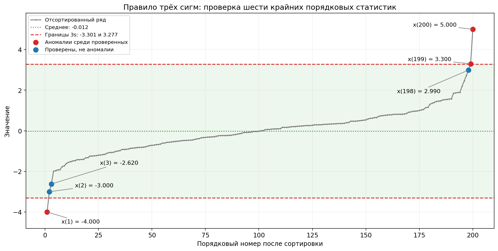
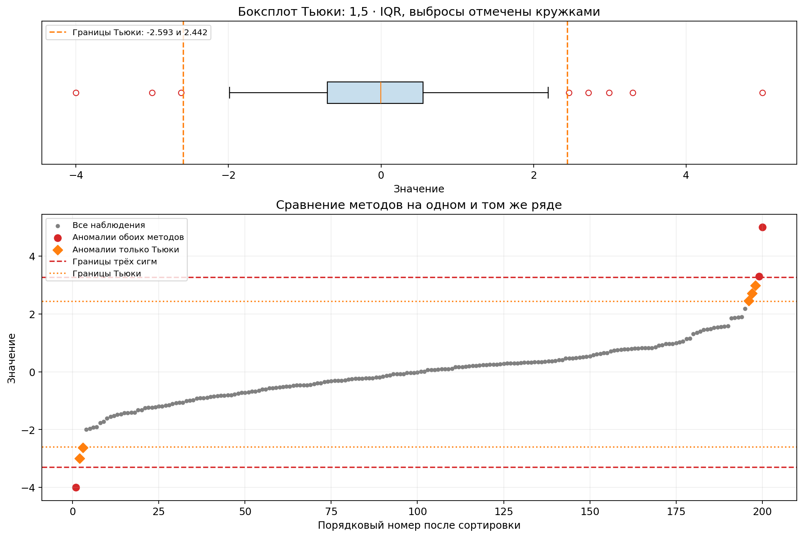

# Лабораторная работа 03_02

## Условие

1. Сгенерировать модельный ряд $x_k\sim N(0,1)$, $k=1,\ldots,195$.
   - Дополнить его пятью значениями: **5, −4, 3.3, 2.99, −3**.
   - Отсортировать ряд и применить правило трёх сигм для проверки на аномальность трёх первых и трёх последних порядковых статистик.
2. Построить для сгенерированного ряда боксплот Тьюки, выделить обнаруженные аномальные значения. Сравнить с результатами предыдущего задания. Сделать выводы.

## План решения

1. Сгенерировать 195 независимых стандартных нормальных значений и добавить пять заданных чисел.
2. Отсортировать все 200 наблюдений, оценить среднее и стандартное отклонение по полной выборке, проверить шесть крайних порядковых статистик.
3. Вычислить квартили и межквартильный размах, построить боксплот Тьюки для всех 200 наблюдений.
4. Сравнить списки найденных аномалий и объяснить различия методов.

## Структура и запуск

Как в [примере лабораторной](https://github.com/azya0/big_data_2025/tree/main/labs/04), программа находится в `src/main.py`. В ней отдельно выделены генерация данных, правило трёх сигм, метод Тьюки и построение графиков. Пояснения и отчёт находятся в этом README.

Установка зависимостей из корня проекта:

```bash
python -m pip install -r labs/03_02/requirements.txt
```

Запуск в текущем окружении проекта:

```bash
.venv/bin/python labs/03_02/src/main.py
```

Программа выводит отсортированный ряд, результаты проверок и сохраняет два графика в `results`. При запуске из терминала графики также открываются в окнах. Для сохранения без окон:

```bash
.venv/bin/python labs/03_02/src/main.py --save
```

При активированном виртуальном окружении вместо `.venv/bin/python` можно писать `python`. Интернет для запуска не требуется.

## 1. Модельный ряд и правило трёх сигм

Использован **seed=42**, как в примере. `np.random.RandomState(42)` воспроизводит ту же последовательность нормальных значений, что и `np.random.seed(42)` с последующим `np.random.normal` в примере. После добавления пяти чисел размер выборки равен **200**.

Все оценки рассчитываются **после добавления** заданных чисел, по полной выборке. Наблюдения не удаляются, границы после каждой проверки не пересчитываются.

Правило из лекции 12:

$$
|x_{(i)}-\bar{x}|>3s,
\qquad
\bar{x}=\frac{1}{n}\sum_{j=1}^{n}x_j,
\qquad
s=\sqrt{\frac{1}{n}\sum_{j=1}^{n}(x_j-\bar{x})^2}.
$$

Как в примере, для стандартного отклонения используется **делитель n**, то есть `ddof=0`. В лекции формула оценки s отдельно не уточняется. Значение, равное границе, не признаётся аномалией: неравенство строгое. Решения принимаются по неокруглённым значениям.

| Характеристика | Значение |
|---|---:|
| Число наблюдений n | 200 |
| Среднее | −0.012173 |
| Стандартное отклонение s | 1.096259 |
| Нижняя граница: среднее − 3s | −3.300950 |
| Верхняя граница: среднее + 3s | 3.276604 |

Проверены именно **x₍₁₎, x₍₂₎, x₍₃₎, x₍₁₉₈₎, x₍₁₉₉₎, x₍₂₀₀₎** — первые три и последние три элемента отсортированного ряда.

| Порядковая статистика | Значение | Отклонение от среднего в единицах s | Аномалия по трём сигмам |
|---|---:|---:|---|
| x₍₁₎ | −4.000000 | 3.637669 | Да |
| x₍₂₎ | −3.000000 | 2.725476 | Нет |
| x₍₃₎ | −2.619745 | 2.378610 | Нет |
| x₍₁₉₈₎ | 2.990000 | 2.738562 | Нет |
| x₍₁₉₉₎ | 3.300000 | 3.021342 | Да |
| x₍₂₀₀₎ | 5.000000 | 4.572070 | Да |

**Результат правила трёх сигм: −4, 3.3, 5 — три аномалии среди шести проверенных значений.**



Серым показан весь отсортированный ряд. Красным отмечены обнаруженные аномалии, синим — проверенные значения, которые остались внутри границ. Зелёная область соответствует интервалу среднего ± 3s.

## 2. Боксплот Тьюки

Боксплот построен для того же ряда из **200 значений**, включая пять добавленных чисел. Используются нижний квартиль Q₁, медиана Q₂ и верхний квартиль Q₃. Квартили вычисляются линейной интерполяцией (`np.percentile`, `method="linear"`), согласованно с боксплотом Matplotlib.

$$
IQR=Q_3-Q_1,\qquad L=Q_1-1.5\,IQR,\qquad U=Q_3+1.5\,IQR.
$$

Наблюдение признаётся аномальным, если **x < L** или **x > U**. В отличие от первого пункта, здесь проверяются все 200 значений.

| Характеристика | Значение |
|---|---:|
| Q₁ | −0.705128 |
| Медиана Q₂ | −0.004192 |
| Q₃ | 0.553634 |
| IQR | 1.258762 |
| Нижняя граница L | −2.593271 |
| Верхняя граница U | 2.441777 |
| Нижний конец уса | −1.987569 |
| Верхний конец уса | 2.190456 |

**Границы отбраковки и концы усов различаются:** в стандартном боксплоте Matplotlib усы заканчиваются на крайних наблюдениях внутри интервала [L, U]. Сами границы дополнительно показаны пунктирными линиями.



Сверху — боксплот с выбросами, снизу — сравнение обоих методов на отсортированном ряде. Красные точки признаны аномалиями обоими методами; оранжевые ромбы входят только в список Тьюки.

**Боксплот выделил восемь значений:**

**−4; −3; −2.619745; 2.463242; 2.720169; 2.99; 3.3; 5.**

## 3. Сравнение и выводы

| Значение | Происхождение | Три сигмы: проверка шести крайних | Боксплот Тьюки |
|---:|---|---|---|
| −4 | Добавлено | Аномалия | Аномалия |
| −3 | Добавлено | Не аномалия | Аномалия |
| −2.619745 | Из N(0,1) | Не аномалия | Аномалия |
| 2.463242 | Из N(0,1) | Не проверялось | Аномалия |
| 2.720169 | Из N(0,1) | Не проверялось | Аномалия |
| 2.99 | Добавлено | Не аномалия | Аномалия |
| 3.3 | Добавлено | Аномалия | Аномалия |
| 5 | Добавлено | Аномалия | Аномалия |

1. **Оба метода выделили −4, 3.3 и 5.** Правило трёх сигм обнаружило три из пяти добавленных значений; −3 и 2.99 остались внутри его границ.
2. **Тьюки выделил все пять добавленных значений и ещё три значения из нормального генератора.** Его границы для этой выборки уже, чем интервал среднего ± 3s, поэтому он чувствительнее к крайним наблюдениям.
3. Области проверки различаются: в первом пункте проверяются только шесть крайних порядковых статистик, во втором — весь ряд. Значения 2.463242 и 2.720169 не входят в проверяемую шестёрку. Для данной выборки они также лежат внутри интервала трёх сигм: их добавление к проверке не изменило бы список его аномалий.
4. Среднее и стандартное отклонение чувствительны к крайним значениям. Добавленные числа увеличивают оценку разброса, что расширяет границы трёх сигм и может скрывать менее выраженные отклонения. Квартили и IQR устойчивее к отдельным крайним наблюдениям.
5. **Статистическая аномалия не обязательно означает ошибку данных.** Значения −2.619745, 2.463242 и 2.720169 действительно сгенерированы из N(0,1), но попали за границы Тьюки. Большее число отмеченных точек само по себе не доказывает превосходство метода. Результаты относятся к данной реализации с seed=42.

## Сопоставление с лекцией и примером

Использованы правило трёх сигм со слайда 4, границы боксплота Тьюки со слайда 9 и задание с последнего слайда **«Лекции 12»**. Другие критерии и модификации боксплота, упомянутые в лекции, в задание не входят.

В [исходном коде примера](https://github.com/azya0/big_data_2025/blob/main/labs/04/src/main.py) используются тот же seed=42, 195 нормальных значений, пять заданных добавлений, стандартное отклонение `ddof=0` и стандартный боксплот с коэффициентом 1.5. Эти настройки сохранены. Результаты методов совпадают. Дополнительно приведены таблица шести проверок, происхождение выбросов и графическое сравнение границ.

## Что показывать при сдаче

1. График **01** и таблицу шести порядковых статистик — применение правила трёх сигм.
2. График **02** и список восьми выбросов — боксплот Тьюки.
3. Таблицу сравнения и вывод: три сигмы обнаружили 3 значения, Тьюки — 8; различия обусловлены границами методов и областью проверки.

Числа в отчёте приведены для seed=42. Повторный запуск воспроизводит данные и обновляет графики; README автоматически не перезаписывается.
